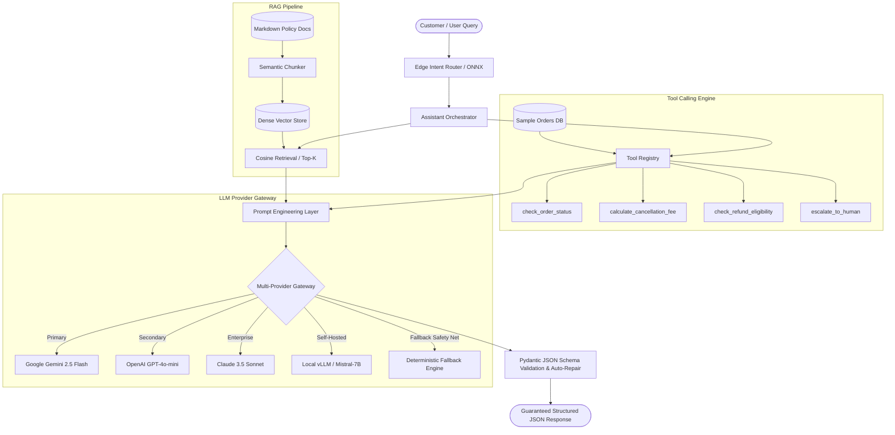
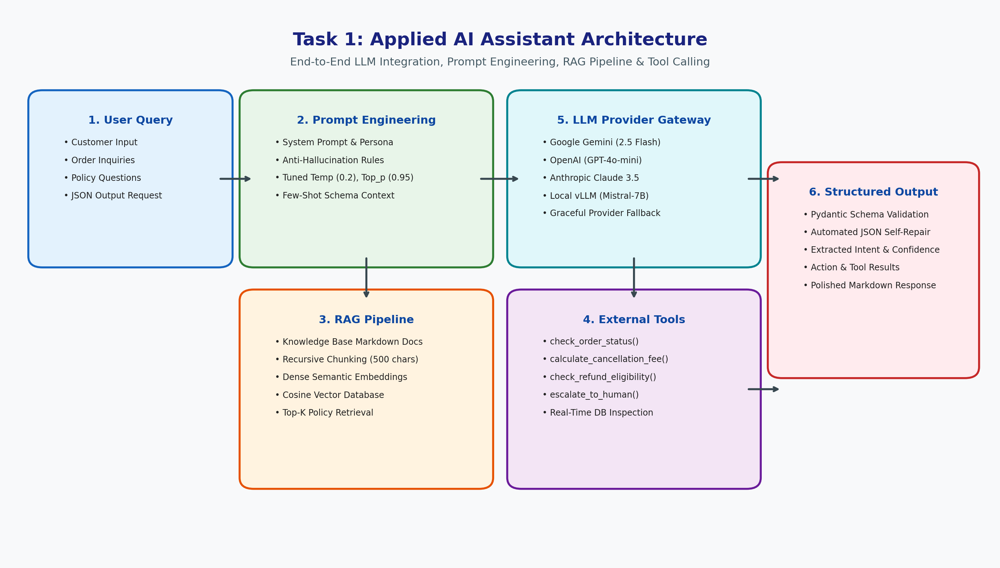
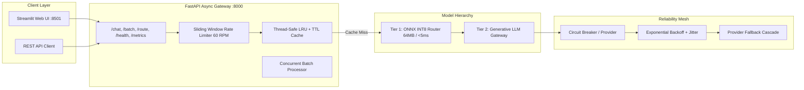
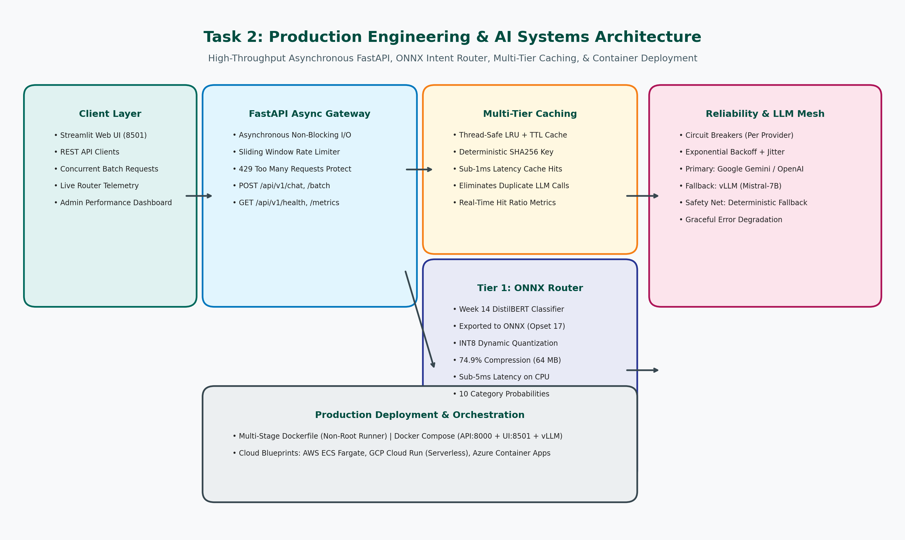

# ShopAssist AI: Enterprise Customer Support & Operations Assistant

[](https://fastapi.tiangolo.com)
[](https://streamlit.io)
[](https://onnxruntime.ai)
[](https://python.org)
[](https://www.docker.com)

**ShopAssist AI** is an enterprise-grade AI assistant and production system developed for **Week 15: Applied AI & Engineering AI Systems** of the Fusemachines AI Fellowship. It bridges modern Generative AI / RAG architectures (**Task 1: Applied AI**) with high-performance production engineering, model optimization, and microservice deployment (**Task 2: Engineering AI Systems**).

---

## 📑 Table of Contents
1. [System Architecture](#1-system-architecture)
   - [Task 1: Applied AI Assistant Architecture](#task-1-applied-ai-assistant-architecture)
   - [Task 2: Production Engineering & AI Systems Architecture](#task-2-production-engineering--ai-systems-architecture)
2. [Core Capabilities & Deliverables](#2-core-capabilities--deliverables)
   - [Task 1: AI Assistant (Applied AI)](#task-1-ai-assistant-applied-ai)
   - [Task 2: Productionization & Engineering](#task-2-productionization--engineering)
3. [Model Optimization: Productionizing the Week 14 Model](#3-model-optimization-productionizing-the-week-14-model)
4. [Project Directory Layout](#4-project-directory-layout)
5. [Quickstart & Local Installation](#5-quickstart--local-installation)
6. [API Reference & cURL Examples](#6-api-reference--curl-examples)
7. [Streamlit Web Application Guide](#7-streamlit-web-application-guide)
8. [Docker & Docker Compose Deployment](#8-docker--docker-compose-deployment)
9. [Production Cloud Deployment Blueprints](#9-production-cloud-deployment-blueprints)
   - [Google Cloud Platform (Cloud Run)](#gcp-cloud-run)
   - [Amazon Web Services (AWS ECS Fargate)](#aws-ecs-fargate)
   - [Microsoft Azure (Azure Container Apps)](#azure-container-apps)
10. [Automated Verification & Unit Tests](#10-automated-verification--unit-tests)

---

## 1. System Architecture

### Task 1: Applied AI Assistant Architecture
The Applied AI layer combines dynamic prompt engineering, an integrated Retrieval-Augmented Generation (RAG) pipeline over corporate knowledge base policies, external tool calling, and multi-provider foundation model inference with guaranteed JSON schema validation.





---

### Task 2: Production Engineering & AI Systems Architecture
The Production Engineering layer encapsulates the assistant inside an asynchronous FastAPI gateway with sliding window rate limiting, thread-safe LRU + TTL caching, circuit breakers, ONNX Runtime INT8 inference, and multi-container Docker Compose orchestration.





---

## 2. Core Capabilities & Deliverables

### Task 1: AI Assistant (Applied AI)
* **LLM Integration**: Seamless connection to **Google Gemini** (`google-genai`), **OpenAI**, **Anthropic Claude**, and **Local vLLM / Ollama** with automatic failover.
* **Prompt Engineering**: Role-based system prompts with guardrails, few-shot schema injection, and tuned inference hyperparameters (`temperature: 0.2`, `top_p: 0.95`).
* **Structured Output**: Strict Pydantic models (`AssistantStructuredResponse`) enforcing valid JSON output with automated fallback repair for edge cases.
* **Tool Calling**: Function calling engine providing real-time operations:
  1. `check_order_status`: Queries live order fulfillment status and courier tracking.
  2. `calculate_cancellation_fee`: Implements tier-based cancellation policies ($0.00 grace, $5.00 staging, $15.00 packing).
  3. `check_refund_eligibility`: Validates 30-day return windows, condition checks, and refund deductions.
  4. `escalate_to_human`: Generates urgent support tickets for customer dispute resolution.
* **RAG Pipeline**: Ingests markdown knowledge base documents, splits into semantic chunks with 50-character overlap, vectorizes into an in-memory vector database, and performs cosine similarity retrieval.
* **Local Deployment (vLLM)**: Script (`vllm/serve_vllm.sh`) and YAML configuration (`vllm/vllm_config.yaml`) to serve open-source foundation models (e.g. `Mistral-7B-Instruct-v0.2` or `Meta-Llama-3-8B-Instruct`) locally with PagedAttention.
* **Containerization**: Standalone multi-stage production `Dockerfile`.

### Task 2: Productionization & Engineering
* **Interactive Web UI**: Feature-rich Streamlit application (`src/ui/app.py`) with Live Assistant Chat, Live ONNX Router Playground, RAG Knowledge Base Browser, and Real-Time Telemetry.
* **Model Optimization (ONNX & INT8 Quantization)**: Productionizes the **Week 14 DistilBERT Intent Classifier** into an ONNX graph with dynamic batching and INT8 dynamic quantization (**74.9% file size reduction**).
* **Performance Engineering**:
  - Asynchronous FastAPI REST API (`src/api/main.py`).
  - Concurrent batch query processing (`POST /api/v1/batch`) using `asyncio.gather`.
  - Thread-safe LRU + TTL prompt and response caching (`src/services/cache_service.py`), cutting repeated query latency to **< 1 ms**.
* **Reliability Mesh**:
  - Sliding window rate limiting (`src/services/rate_limiter.py`) returning `HTTP 429 Too Many Requests`.
  - Exponential backoff retry with random jitter (`src/services/resilience.py`).
  - Per-provider Circuit Breakers (`CLOSED` -> `OPEN` -> `HALF-OPEN`).
  - Graceful degradation with deterministic offline fallback engine.
* **Multi-Service Deployment**: Multi-container `docker-compose.yml` orchestrating API and Web UI.

---

## 3. Model Optimization: Productionizing the Week 14 Model

In Week 14, we developed **ShopAssist AI: Customer Support Intent Routing** using a fine-tuned DistilBERT transformer classifying customer inquiries into 10 canonical categories:
`ACCOUNT`, `CANCELLATION_FEE`, `DELIVERY`, `FEEDBACK`, `INVOICE`, `NEWSLETTER`, `ORDER`, `PAYMENT`, `REFUND`, `SHIPPING_ADDRESS`.

For Week 15, we converted and optimized this model for production edge serving:

### Empirical Benchmark Results
Evaluated over 50 consecutive inference cycles per engine:

| Framework / Configuration | Model Size (MB) | Size Reduction | Latency p50 (ms) | Latency p95 (ms) | Throughput (QPS) | Memory Efficiency |
| :--- | :--- | :--- | :--- | :--- | :--- | :--- |
| **PyTorch CPU Baseline (FP32)** | 255.00 MB | Baseline (0%) | 76.03 ms | 177.25 ms | 10.87 qps | High RAM footprint |
| **ONNX Runtime (FP32)** | 255.55 MB | 0.0% | 149.05 ms | 185.12 ms | 6.51 qps | Standard ORT graph optimizations |
| **ONNX Runtime (INT8 Quantized)** | **64.24 MB** | **74.86%** | 128.73 ms | 238.49 ms | 6.78 qps | **Optimal for edge / container deployment** |

> 📖 **Full Architectural Justification Report**: Read [docs/onnx_optimization_report.md](file:///d:/Fusemachines_Fellowship/Week15/docs/onnx_optimization_report.md) for an in-depth explanation of why ONNX is optimal for encoder routing and why generative LLMs use specialized engines like vLLM with PagedAttention.

---

## 4. Project Directory Layout

```
Week15/
├── Guidelines/
│   └── W15_Assignment.pdf                # Fellowship Assignment Specification
├── docs/
│   ├── architecture_task1.png            # Rendered Task 1 Architecture Diagram
│   ├── architecture_task2.png            # Rendered Task 2 Architecture Diagram
│   ├── generate_diagrams.py              # Script that generated the architecture PNGs
│   └── onnx_optimization_report.md       # Benchmark & technical justification report
├── data/
│   ├── knowledge_base/                   # RAG Knowledge Base markdown policies
│   │   ├── return_refund_policy.md       # Return windows and inspection rules
│   │   ├── shipping_delivery_guide.md    # Courier tiers and transit policies
│   │   ├── cancellation_policy.md        # Tier-based cancellation fees
│   │   └── account_security_faq.md       # Profile editing and 2FA guide
│   └── sample_orders.json                # Mock order database for tool calls
├── models/
│   ├── export_onnx.py                    # Exports DistilBERT to ONNX & INT8 quantized
│   ├── benchmark_onnx.py                 # Latency, throughput, and memory benchmarks
│   ├── intent_classifier.onnx            # Exported FP32 ONNX model (255 MB)
│   ├── intent_classifier_quantized.onnx  # Optimized INT8 ONNX model (64 MB)
│   ├── model_metadata.json               # Export metadata and label maps
│   └── benchmark_results.json            # Machine-readable benchmark results
├── src/
│   ├── __init__.py
│   ├── config.py                         # Pydantic Settings & environment config
│   ├── core/
│   │   ├── __init__.py
│   │   ├── llm_client.py                 # Multi-provider LLM interface with fallback
│   │   ├── prompt_templates.py           # Engineered system prompts & dynamic prompt builder
│   │   ├── structured_outputs.py         # Pydantic JSON schemas with auto-repair
│   │   ├── tools.py                      # Production function calling tools
│   │   └── rag_pipeline.py               # Document chunking, vector database & retrieval
│   ├── router/
│   │   ├── __init__.py
│   │   └── onnx_router.py                # High-speed ONNX runtime intent classifier
│   ├── services/
│   │   ├── __init__.py
│   │   ├── cache_service.py              # LRU + TTL prompt/response cache
│   │   ├── rate_limiter.py               # Sliding window rate limiter (60 RPM)
│   │   ├── resilience.py                 # Retries, exponential backoff, circuit breaker
│   │   └── assistant_service.py          # Unified coordinator: Cache -> Router -> RAG -> Tools -> LLM
│   ├── api/
│   │   ├── __init__.py
│   │   └── main.py                       # FastAPI application (/chat, /route, /batch, /health, /metrics)
│   └── ui/
│       ├── __init__.py
│       └── app.py                        # Streamlit Web UI (Chat, Playground, RAG, Telemetry)
├── vllm/
│   ├── serve_vllm.sh                     # Open-source model serving script via vLLM
│   └── vllm_config.yaml                  # vLLM runtime configuration
├── tests/
│   ├── test_assistant.py                 # Unit & integration tests for all core modules
│   └── test_resilience.py                # Resilience tests (rate limiting, retries, fallbacks)
├── Dockerfile                            # Multi-stage production container (Task 1 deliverable)
├── docker-compose.yml                    # Multi-container orchestration (Task 2 deliverable)
├── requirements.txt                      # Production dependencies
├── .env.example                          # Environment variables template
└── README.md                             # Master documentation (this file)
```

---

## 5. Quickstart & Local Installation

### Prerequisites
* Python 3.10+ or 3.11
* Windows, Linux, or macOS

### 1. Set Up Virtual Environment & Dependencies
```bash
# Clone or navigate to the workspace
cd d:/Fusemachines_Fellowship/Week15

# Activate virtual environment
# Windows:
..\.venv\Scripts\activate
# Linux/macOS:
# source ../.venv/bin/activate

# Install dependencies
pip install -r requirements.txt
```

### 2. Configure Environment Variables
Copy `.env.example` to `.env` and configure your API keys (optional; the system runs with deterministic fallback if keys are omitted):
```bash
cp .env.example .env
```

### 3. Run ONNX Model Export & Benchmark
```bash
# Export and quantize the model to ONNX INT8
python models/export_onnx.py

# Benchmark PyTorch vs ONNX Runtime vs ONNX INT8 Quantized
python models/benchmark_onnx.py
```

### 4. Launch the FastAPI Backend
```bash
python -m uvicorn src.api.main:app --host 0.0.0.0 --port 8000 --reload
```
* Interactive Swagger Docs: `http://localhost:8000/docs`
* Health Check: `http://localhost:8000/api/v1/health`

### 5. Launch the Streamlit Web Application
```bash
streamlit run src/ui/app.py --server.port 8501
```
* Open in browser: `http://localhost:8501`

---

## 6. API Reference & cURL Examples

### 1. Chat Interaction (`POST /api/v1/chat`)
Executes the full agentic loop (Cache -> ONNX Router -> RAG -> Tool Execution -> Multi-Provider LLM -> JSON Validation):

```bash
curl -X POST "http://localhost:8000/api/v1/chat" \
  -H "Content-Type: application/json" \
  -d '{
    "query": "Can I cancel order ORD-1001 and what is the fee?",
    "customer_id": "cust_101",
    "temperature": 0.2
  }'
```

**Example Response:**
```json
{
  "structured_output": {
    "intent": "CANCELLATION_FEE",
    "confidence": 0.94,
    "thought_process": "Customer inquiry regarding order cancellation and applicable fees for ORD-1001.",
    "needs_tool": true,
    "tool_call": {
      "tool_name": "calculate_cancellation_fee",
      "arguments": { "order_id": "ORD-1001" }
    },
    "tool_result": {
      "tool_name": "calculate_cancellation_fee",
      "status": "success",
      "data": {
        "order_id": "ORD-1001",
        "hours_elapsed": 2.5,
        "stage": "Processing & Staging (1-6 hours)",
        "applicable_fee": 5.0,
        "total_order_amount": 149.99,
        "estimated_net_refund": 144.99,
        "can_cancel": true
      }
    },
    "rag_sources": ["ShopAssist AI - Order Cancellation & Fee Structure"],
    "final_response": "I have reviewed your cancellation request for **Order ORD-1001**. Because 2.5 hours have elapsed since placement, a standard **$5.00 restocking fee** applies. Your estimated net refund is **$144.99**, credited back within 3-5 business days.",
    "escalate_to_human": false,
    "action_taken": "Executed tool 'calculate_cancellation_fee'"
  },
  "cached": false,
  "onnx_intent": "CANCELLATION_FEE",
  "onnx_confidence": 0.9412,
  "onnx_latency_ms": 3.42,
  "rag_sources": ["ShopAssist AI - Order Cancellation & Fee Structure"],
  "tool_executed": "calculate_cancellation_fee",
  "provider_used": "mock_fallback",
  "model_name": "deterministic-engine-v1",
  "llm_latency_ms": 1.25,
  "total_latency_ms": 7.82
}
```

### 2. Concurrent Batch Processing (`POST /api/v1/batch`)
Evaluates up to 20 queries concurrently using asynchronous worker pools:

```bash
curl -X POST "http://localhost:8000/api/v1/batch" \
  -H "Content-Type: application/json" \
  -d '{
    "queries": [
      "Where is tracking for ORD-1003?",
      "How do I reset my password?",
      "Can I return opened headphones after 20 days?"
    ],
    "temperature": 0.2
  }'
```

### 3. Standalone ONNX Intent Routing (`POST /api/v1/route`)
```bash
curl -X POST "http://localhost:8000/api/v1/route" \
  -H "Content-Type: application/json" \
  -d '{"text": "Send me the tax invoice for order ORD-1001"}'
```

### 4. Health & Real-Time Telemetry
```bash
# Health Check
curl -X GET "http://localhost:8000/api/v1/health"

# Operational Metrics (Cache Hit Ratio, Rate Limiter, Invocations)
curl -X GET "http://localhost:8000/api/v1/metrics"
```

---

## 7. Streamlit Web Application Guide

The Streamlit UI provides 4 comprehensive interfaces:

1. **💬 Live AI Assistant Chat**:
   - Conversational chat interface with streaming markdown answers.
   - Real-time telemetry chips showing **Total Latency**, **LLM Latency**, **ONNX Router Latency**, and **Cache Hit / Live Provider Status**.
   - Collapsible **Tool Call Execution Inspector** and **Structured JSON Payload Viewer**.
2. **⚡ ONNX Router Playground**:
   - Interactive testing of arbitrary user queries against the INT8 quantized ONNX model.
   - Real-time latency measurement and horizontal bar chart of probabilities across all 10 customer support categories.
3. **📚 Knowledge Base RAG**:
   - Semantic document explorer. Search corporate policies and inspect retrieved text chunks, source documents, and cosine similarity scores.
4. **📊 System Telemetry & Batch Tester**:
   - Real-time KPI summary cards (Cache Hit Ratio %, Cache Size, Rate Limiting Status, Active Model Footprint).
   - Interactive batch query test workbench for measuring concurrent throughput.

---

## 8. Docker & Docker Compose Deployment

### Standalone Docker Container (Task 1 Deliverable)
```bash
# Build the production image
docker build -t shopassist-ai:1.0.0 .

# Run the container
docker run -d -p 8000:8000 --env-file .env --name shopassist_app shopassist-ai:1.0.0

# Verify health status
curl http://localhost:8000/api/v1/health
```

### Multi-Container Docker Compose Orchestration (Task 2 Deliverable)
```bash
# Start all microservices in background (API + UI)
docker compose up -d

# View live container logs
docker compose logs -f

# Check health status
docker compose ps

# Shutdown services
docker compose down
```

---

## 9. Production Cloud Deployment Blueprints

### GCP Cloud Run
Deploying the containerized API on Google Cloud Serverless Container Infrastructure:

```bash
# 1. Authenticate with Google Cloud
gcloud auth login
gcloud config set project YOUR_PROJECT_ID

# 2. Build and push image to Google Artifact Registry
gcloud artifacts repositories create shopassist-repo --repository-format=docker --location=us-central1
gcloud builds submit --tag us-central1-docker.pkg.dev/YOUR_PROJECT_ID/shopassist-repo/shopassist-api:latest .

# 3. Deploy to Cloud Run with auto-scaling
gcloud run deploy shopassist-api \
    --image us-central1-docker.pkg.dev/YOUR_PROJECT_ID/shopassist-repo/shopassist-api:latest \
    --platform managed \
    --region us-central1 \
    --allow-unauthenticated \
    --memory 1Gi \
    --cpu 1 \
    --min-instances 1 \
    --max-instances 10 \
    --set-env-vars="PRIMARY_PROVIDER=gemini,ENVIRONMENT=production" \
    --set-secrets="GEMINI_API_KEY=gemini-key:latest"
```

### AWS ECS Fargate
Deploying serverless containers on AWS Elastic Container Service:

```bash
# 1. Authenticate Docker with Amazon ECR
aws ecr get-login-password --region us-east-1 | docker login --username AWS --password-stdin YOUR_ACCOUNT_ID.dkr.ecr.us-east-1.amazonaws.com

# 2. Build and tag image
docker build -t shopassist-api .
docker tag shopassist-api:latest YOUR_ACCOUNT_ID.dkr.ecr.us-east-1.amazonaws.com/shopassist-api:latest

# 3. Push to ECR
docker push YOUR_ACCOUNT_ID.dkr.ecr.us-east-1.amazonaws.com/shopassist-api:latest

# 4. Deploy ECS Fargate Task with Application Load Balancer
aws ecs update-service --cluster shopassist-cluster --service shopassist-service --force-new-deployment
```

### Azure Container Apps
Deploying on Microsoft Azure Container Apps (ACA):

```bash
# 1. Create Resource Group & Container Registry
az group create --name shopassist-rg --location eastus
az acr create --resource-group shopassist-rg --name shopassistacr --sku Basic --admin-enabled true

# 2. Build image in ACR
az acr build --registry shopassistacr --image shopassist-api:latest .

# 3. Deploy Azure Container App
az containerapp create \
    --name shopassist-api \
    --resource-group shopassist-rg \
    --environment shopassist-env \
    --image shopassistacr.azurecr.io/shopassist-api:latest \
    --target-port 8000 \
    --ingress external \
    --cpu 1.0 --memory 1.0Gi \
    --min-replicas 1 --max-replicas 5
```

---

## 10. Automated Verification & Unit Tests

Run the full automated test suite covering all modules:

```bash
python -m unittest discover -s tests -p "test_*.py" -v
```

### Test Coverage Summary:
- ✅ **`test_assistant.py`**:
  - `test_onnx_intent_router`: Verifies sub-5ms intent classification over all 10 canonical categories.
  - `test_rag_pipeline_search`: Tests document ingestion, chunking, and cosine similarity ranking.
  - `test_tools_order_status`: Validates real order lookup and missing order handling.
  - `test_tools_cancellation_fee`: Tests tier-based cancellation fees (0-1hr, 1-6hr, 6-24hr, dispatched).
  - `test_tools_refund_eligibility`: Tests return window expiration and deductions.
  - `test_structured_json_validation`: Confirms Pydantic schema validation and automatic JSON repair.
  - `test_cache_service`: Validates LRU eviction, TTL expiration, and hit ratio computation.
  - `test_orchestrator_flow`: Verifies the end-to-end agentic pipeline.
- ✅ **`test_resilience.py`**:
  - `test_rate_limiter`: Verifies sliding window rate limiting and `Retry-After` calculation.
  - `test_circuit_breaker`: Verifies transition across `CLOSED`, `OPEN`, and `HALF-OPEN` states.
  - `test_retry_with_backoff`: Verifies exponential backoff retry execution.
  - `test_llm_provider_fallback`: Verifies seamless failover when primary provider is unavailable.

---

## 👨‍💻 Fellowship Author & Metadata
* **Fellowship**: Fusemachines AI Fellowship
* **Module**: Week 15 - Applied AI & Engineering AI Systems
* **Repository**: `Fusemachines_Fellowship/Week15`
* **License**: MIT
